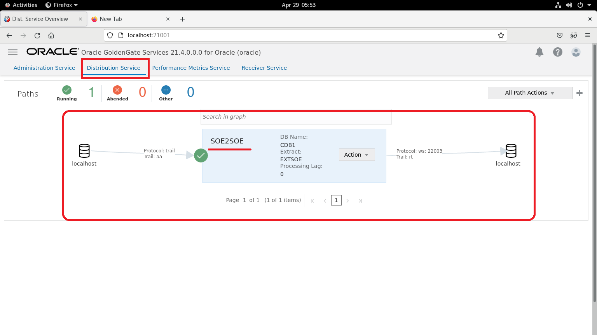

#  MySQL to HDFS(delimited text format)


## Introduction
In this lab we will load data in MySQL database `ggsource`, GG extract process `extmysql` will capture the changes from MySQL’s binary logs and write them to the local trail file. The pump process `pmphadop` will route the data from the local trail (on the source) to the remote trail (on the target). The replicat
process `rhdfs` will read the remote trail files, and write the data to the HDFS target directory
/user/ggtarget/hdfs/

*Estimated Lab Time*:  60 minutes

#### Lab Architecture

  

### Objectives
- Explore GoldenGate replication from **MySQL to HDFS**

### Prerequisites
This lab assumes you have:
- A Free Tier, Paid or LiveLabs Oracle Cloud account
- SSH Private Key to access the host via SSH
- You have completed:
    - Lab: Generate SSH Keys (*Free-tier* and *Paid Tenants* only)
    - Lab: Prepare Setup (*Free-tier* and *Paid Tenants* only)
    - Lab: Environment Setup
    - Lab: Deploy GoldenGate for Big Data

## Task 1: GoldenGate Configuration Reset

1.	Open  a terminal and type ***ggreset***,to reset the lab.


## Task 2: GoldenGate Configuration  for oracle as Source
1.	Open  a terminal and type ***extract***,to create a extract ***EXTSOE*** and a path ***SOE2SOE*** through cURL commands.

2. To validate the GoldenGate process, Open a browser and login to Administrator service of Oracle  with username as ***oggadmin*** and password as ***Welcome1***.

    ```
    <copy> http://localhost:21001/?root=account </copy>
    ```

3. On welcome pages, a green ticker with name ***EXTSOE*** indicates extract is up and running on the  Administratation Service.

4. Navigate to Distrubution Service, to validate the path ***SOE2SOE*** 


Source deployment completed!

## Task 3: GoldenGate Configuration  for HDFS as Target

1. To create a replicat,logon to Administrator service of GoldenGate(MA) of BigData from the below url with username as '***oggadmin***' and password as '***Welcome1***' 

    ```
    <copy> http://localhost:22001/?root=account </copy>
    ```

2. On welcome pages, Click on the '***+***' to get the replicat creation wizard

3. Kindly choose replicat type as ***Classic Replicat*** and click to **Next** to procede to Replicat Options.

4. Type replicat process name as '***REPHDFS***' 

5.  Enter trail Name as '***rt***' ,which is recieved from the source ***oracle database***

6. Choose target as ***HDFS*** from the top-down menu


7. update the parameter file from the below content and click **Next** to navigate properties file tab


8. Append pathMappingTemplate as "***/livelab***" 
  gg.eventhandler.name.pathMappingTemplate,A string with resolvable keywords and constants used to dynamically generate the path in HDFS to write data files.
  ```
  <copy>
  /livelab
  </copy>
  ``` 


9. Update "**fileNameMappingTemplate**" as "***${fullyQualifiedTableName}_${groupName}_${currentTimestamp}.txt*** 
  fileNameMappingTemplate,A string with resolvable keywords and constants used to dynamically generate the HDFS file name at runtime.
  ```
  <copy>
  ${fullyQualifiedTableName}_${groupName}_${currentTimestamp}.txt
  </copy>
  ```

10. Update the **gg.classpath** as follows below and click ***create and run*** to complete the replication creation wizard
 
 gg.classpath includes the HDFS client libraries.Ensure that the directory containing the HDFS core-site.xml file is in gg.classpath. This is so the core-site.xml file can be read at runtime and the connectivity nformation to HDFS can be resolved.
```
<copy>
/u01/hadoop/etc/hadoop:/u01/hadoop/share/hadoop/common/lib/*:/u01/hadoop/share/hadoop/common/*:/u01/hadoop/share/hadoop/hdfs/*:/u01/hadoop/share/hadoop/hdfs/lib/*
</copy>

```


## Summary
To summarize, you loaded data in the oracle database `‘SOE’` schema of Pluggable database `‘PDB’` .The GG extract process `‘extsoe’` captured the changes from the oracle database and wrote them to the local trail file `‘ab’`. The distrubution Service `‘SOE2SOE’` will route the trail file  `‘ab’` to target GoldenGate(MA) for BigData reciever Service as `‘rt’` . The replicat process `‘rephdfs’` read the remote trail files, replicated to target hadoop files .

You may now *proceed to the next lab*

## Learn More

* [Oracle GoldenGate for Big Data 21c ](https://docs.oracle.com/en/middleware/goldengate/big-data/21.1/index.html)
* [ Using the HDFS  Handler ](https://docs.oracle.com/en/middleware/goldengate/big-data/21.1/gadbd/using-hdfs-handler.html)
## Acknowledgements
* **Author** - Madhu Kumar S, Data Integration Team, Oracle, May 2022
* **Contributors** - 
* **Last Updated By/Date** - 
